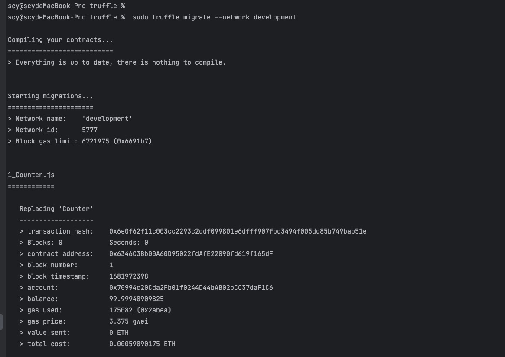

# truffle 相关笔记：
## 1、truffle init 创建工程
## 2、truffle compile 编译
## 3、truffle-config.js 配置相关网络参数
## 4、truffle migrate --network development 部署到指定的网络
## 
创建合约hash: 0x6e0f62f11c003cc2293c2ddf099801e6dfff907fbd3494f005dd85b749bab51e
合约地址： 0x6346C3Bb00A60D95022fdAfE22090fd619f165dF

